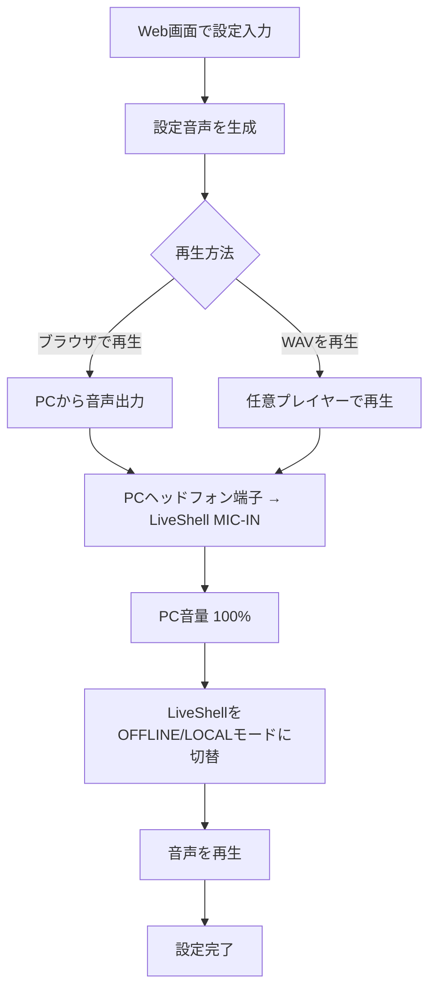

# LiveShell Config Generator

LiveShell PRO ローカルモード設定音声生成ツール

Cerevo Dashboard終了（2025年5月）後も、ローカルモードでLiveShell PROを使用するための設定音声を生成します。

## 機能

- LiveShell PRO / LiveShell 2 のローカルモード設定音声を生成
- ネットワーク設定（Ethernet/Wi-Fi, DHCP/固定IP, ステルスAP, 暗号化方式）
- 配信先プリセット（YouTube Live / Twitch / ニコニコ / その他）
- YouTube連携によるストリームキー自動取得
- ブラウザ上で音声生成・再生、WAVダウンロード

## 使い方（音声生成から）

1. Web画面でデバイス、ネットワーク、配信設定を入力
2. 「設定音声を生成」をクリック
3. 音声を「再生」または「ダウンロード」
4. PCのヘッドフォン端子 → LiveShell の `MIC-IN` に接続
5. PCの音量を `100%` に設定
6. LiveShellを `OFFLINE/LOCAL` モードに切り替え
7. 音声を再生して完了まで待つ

補足: うまく反映されない場合は、音量100%、ケーブルの差し直し、別の再生デバイスで再試行してください。

## 図解



## 技術仕様

Wayback `ls-local.cerevo.com` を解析して特定したFSK仕様:

| パラメータ | 値 |
|-----------|-----|
| 変調 | FSK |
| フレーミング | 8N1（MSB first） |
| CRC | CRC16-CCITT |
| サンプル/bit | 32 |
| プリアンブル / ポストアンブル | 各 12 bit |
| リピート | 3 回 |
| サンプルレート | LiveShell PRO: 44100 Hz / LiveShell 2: 16000 Hz |
| 周波数 | space = sampleRate/8, mark = sampleRate/4（Pro: 5512.5 / 11025 Hz） |

## デプロイ

### Vercel

```bash
npm install
npm run build
# Vercelにデプロイ
```

または GitHub連携で自動デプロイ

### ローカル実行

```bash
npm install
npm run dev
# http://localhost:3000 でアクセス
```

## 注意事項

- この音声フォーマットは解析に基づく推測です
- 動作しない場合は [Wayback Machine](https://web.archive.org/web/20250408014553/https://ls-local.cerevo.com/) をご利用ください
- LiveShell X は未対応です

## ライセンス

MIT
